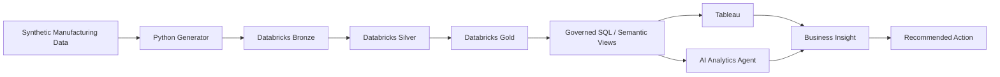

# Manufacturing Intelligence Platform

An AI-enabled manufacturing analytics portfolio project built to turn manufacturing data into governed metrics, interactive Tableau analysis, root-cause evidence, and business actions.

## Business problem

A manufacturing stakeholder sees First Pass Yield (FPY) fall from roughly 97% to 95%. The platform is designed to answer:

1. What changed?
2. Where did it happen?
3. Which factory, product, line, component, supplier, or defect contributed most?
4. Is the apparent decline a real process issue or a product-mix effect?
5. What should the business investigate next?

## Technology focus

- Python 3.12+ for synthetic data generation, validation, automation, and analytics
- Databricks Lakehouse with Bronze / Silver / Gold layers
- Advanced SQL for governed business metrics and root-cause analysis
- Tableau for dashboards, Calculated Fields, LOD Expressions, parameters, and drill-down
- AI analytics agent for evidence-grounded interpretation and investigation orchestration

## Architecture

## MVP scope

The first release focuses on manufacturing quality analytics. Supply-chain delivery and field-RMA analytics are intentionally deferred until the core quality storyline is complete.

Core facts:
- `fact_production`
- `fact_quality_event`

Core dimensions:
- `dim_date`
- `dim_factory`
- `dim_line`
- `dim_product`
- `dim_component`
- `dim_supplier`
- `dim_defect`

## Portfolio story

Business Requirements → Data Contract → Lakehouse → Advanced SQL → Tableau → Root Cause → AI Explanation → Business Action

All data in this repository is synthetic. No NVIDIA or other proprietary company data is used.

## Project status

PR #1 establishes the product foundation, architecture, business metric contracts, synthetic incident specification, Tableau plan, AI boundary, and data-quality expectations.

See `docs/` for the design contracts that future implementation PRs must follow.
