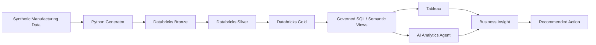

# Manufacturing Intelligence Platform

An AI-enabled manufacturing analytics portfolio project built to turn manufacturing data into governed metrics, interactive Tableau analysis, root-cause evidence, and business actions.

## Business problem

A manufacturing stakeholder sees First Pass Yield (FPY) fall from roughly 97% to 95%. The platform is designed to answer:

1. What changed?
2. Where did it happen?
3. Which factory, product, line, component, supplier, or defect contributed most?
4. Is the apparent decline a real process issue or a product-mix effect?
5. What should the business investigate next?

## Technology focus

- Python 3.12+ for synthetic data generation, validation, automation, and analytics
- Databricks Lakehouse with Bronze / Silver / Gold layers
- Advanced SQL for governed business metrics and root-cause analysis
- Tableau for dashboards, Calculated Fields, LOD Expressions, parameters, and drill-down
- AI analytics agent for evidence-grounded interpretation and investigation orchestration

## Architecture



## MVP scope

The first release focuses on manufacturing quality analytics. Supply-chain delivery and field-RMA analytics are intentionally deferred until the core quality storyline is complete.

Core facts:
- `fact_production`
- `fact_quality_event`

Core dimensions:
- `dim_date`
- `dim_factory`
- `dim_line`
- `dim_product`
- `dim_component`
- `dim_supplier`
- `dim_defect`

## Portfolio story

Business Requirements → Data Contract → Lakehouse → Advanced SQL → Tableau → Root Cause → AI Explanation → Business Action

All data in this repository is synthetic. No NVIDIA or other proprietary company data is used.

## Synthetic data quick start

```bash
python -m pip install -e '.[dev]'
python scripts/generate_data.py --seed 42 --scale demo --output data/generated
```

The command writes CSV and Parquet tables plus a machine-readable incident manifest. The full
generated directory is ignored; a compact CSV fixture is available under `data/sample/`.

The generator models stable factory/product differences and injects five discoverable hidden
causes into failure probability, supplier/component attribution, process risk, rework behavior,
component lots, and product mix. It does not set dashboard KPIs directly.

See `docs/synthetic-data-generation.md` for design and limitations.

## Databricks Bronze ingestion

PR #3 adds an idempotent, serverless Databricks ingestion path from the read-only Unity Catalog
S3 external location into nine source-shaped Bronze Delta tables. Declarative schema and data-
quality contracts route accepted records to `manufacturing_intelligence.bronze` and rejected
records, with their source payload and errors, to `manufacturing_intelligence.quarantine`.

No cloud credentials are stored in the repository and no business metrics are calculated in
Bronze. See `docs/databricks-bronze-ingestion.md` for setup, job execution, validation SQL, and
limitations.

## Silver and Gold analytics

PR #4 publishes nine conformed Silver Delta tables and five Gold analytics tables. Silver retains
the two fact grains while normalizing, deduplicating, and enforcing relationships. Gold owns the
governed additive measures and rates used by Tableau, including product-mix share and weekly FPY
change. Tableau must connect to `manufacturing_intelligence.gold`, not Bronze.

Run `databricks/jobs/run_silver_gold.py` after a successful Bronze load. See
`docs/silver-gold-model.md` for model purposes, metric ownership, validation, and limitations.

## Deployment verification

The production-like demo deployment order is:

```text
seed-42 demo Parquet → S3 → Bronze → Silver → Gold → Databricks SQL → Tableau-ready
```

Use `docs/deployment.md` for the exact generation, upload, bundle deployment, job execution,
idempotency, validation, cost-control, and teardown commands. Tableau connects only to the five
governed tables in `manufacturing_intelligence.gold`.

## Project status

PR #1 establishes the foundation and contracts. PR #2 implements the deterministic synthetic
manufacturing environment. PR #3 adds the Databricks Bronze, data-quality, quarantine, and
file-level idempotency foundation. PR #4 adds conformed Silver and governed Gold analytics.
PR #5–#10 harden Databricks Asset Bundle and serverless runtime compatibility. PR #11 verifies and
documents the complete deployment path.

See `docs/` for the design contracts that future implementation PRs must follow.
