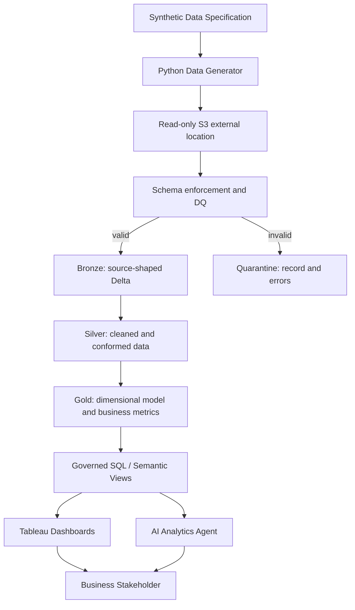

# Architecture

## Objective

Provide a modular analytics path from reproducible synthetic manufacturing data to governed business metrics, Tableau analysis, and evidence-grounded AI explanations.

## Layer responsibilities

### Synthetic generator
Creates deterministic manufacturing, quality, and later supply-chain/RMA events. It also injects known incidents so analytical findings can be regression-tested.

### Bronze
Reads Parquet through the Unity Catalog external location, enforces the PR #2 physical schema,
and preserves source-shaped valid records with ingestion metadata in managed Delta tables.
File-level audit plus existing-key checks provide basic rerun idempotency. No business KPI logic
belongs here.

### Quarantine
Preserves the original rejected record, source file, batch, error code/message, and quarantine
timestamp. It is an explicit observability path, not a silent filter. Dimensions load before facts
so basic FK and orphan production-lot validation can run during Bronze ingestion.

### Silver
Publishes nine conformed Delta tables. It applies deterministic latest-record deduplication,
normalization, relationship enforcement, and technical date fields while preserving both fact
grains. It does not contain dashboard aggregation.

### Gold
Publishes daily manufacturing, factory, product, supplier, and defect-Pareto analytics. Additive
numerators and denominators remain available beside governed rates so filters do not average
percentages. Product-level FPY and product-mix share remain separate to expose mix-driven changes.

### Tableau
Provides interactive business exploration. Tableau-specific calculations are permitted when they are visualization- or view-grain-specific; canonical KPI truth remains upstream.

### AI analytics
Uses governed query results as evidence. It can decompose questions, request approved metrics, compare dimensions, summarize findings, and suggest next investigations.

## MVP boundary

PRs #1–#9 focus on manufacturing quality. Supplier delivery and field RMA are extension domains, not prerequisites for the first complete demo.
