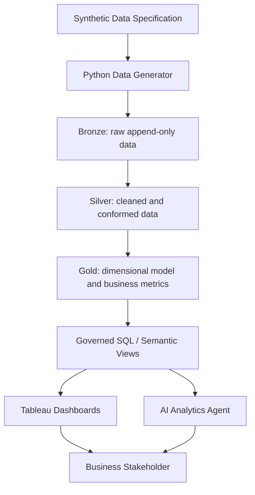

# Architecture

## Objective

Provide a modular analytics path from reproducible synthetic manufacturing data to governed business metrics, Tableau analysis, and evidence-grounded AI explanations.

## Layer responsibilities

### Synthetic generator
Creates deterministic manufacturing, quality, and later supply-chain/RMA events. It also injects known incidents so analytical findings can be regression-tested.

### Bronze
Preserves source-shaped records and ingestion metadata. No business KPI logic belongs here.

### Silver
Applies type normalization, deduplication, conformance, validation, and reusable entity relationships.

### Gold
Publishes fact/dimension models, metric-ready aggregates, benchmark views, and root-cause inputs.

### Tableau
Provides interactive business exploration. Tableau-specific calculations are permitted when they are visualization- or view-grain-specific; canonical KPI truth remains upstream.

### AI analytics
Uses governed query results as evidence. It can decompose questions, request approved metrics, compare dimensions, summarize findings, and suggest next investigations.

## MVP boundary

PRs #1–#9 focus on manufacturing quality. Supplier delivery and field RMA are extension domains, not prerequisites for the first complete demo.
