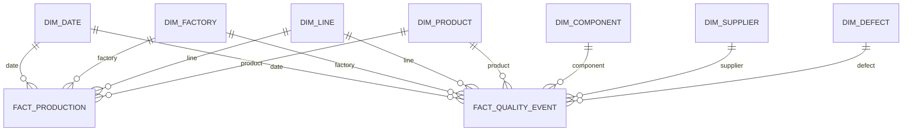

# Data Model

## Modeling approach

Use a dimensional analytical model with explicit fact-table grain. PR #1 defines contracts; later PRs implement physical Delta tables and analytical views.

## `fact_production`

**Grain:** one production date × factory × production line × product × production lot.

Expected measures include started quantity, completed quantity, first-pass pass quantity, fail quantity, rework quantity, and scrap quantity.

The grain supports operational trends while preserving production-lot traceability for incident investigation.

## `fact_quality_event`

**Grain:** one inspection/failure/defect event associated with a production unit or production lot.

An event can reference component, supplier, defect category, test/inspection stage, and disposition. Unit-level identifiers may be synthetic hashed IDs; business analysis should not depend on personally identifying information.

## Dimensions

- `dim_date`: calendar and manufacturing reporting attributes.
- `dim_factory`: site/region/timezone metadata.
- `dim_line`: production line and factory ownership.
- `dim_product`: product family/model/generation hierarchy.
- `dim_component`: component family/type metadata.
- `dim_supplier`: synthetic supplier identity and region/category attributes.
- `dim_defect`: defect category, failure mode, severity, and process stage.

## Future facts

- `fact_supplier_delivery`: one supplier delivery/receipt event.
- `fact_rma`: one field return event.

They are deliberately excluded from MVP implementation until manufacturing-quality analytics is complete.
