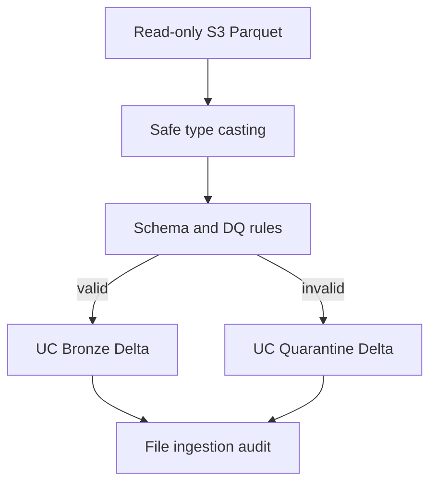

# Databricks Bronze Ingestion

## Purpose

PR #3 introduces the first Databricks workload. It reads the nine PR #2 Parquet datasets from the
read-only Unity Catalog external location and separates source-shaped valid records from traceable
invalid records. It does not calculate KPIs, join analytical models, or change either fact grain.



## Unity Catalog layout

```text
manufacturing_intelligence
├── bronze
│   ├── dim_date
│   ├── dim_factory
│   ├── dim_line
│   ├── dim_product
│   ├── dim_component
│   ├── dim_supplier
│   ├── dim_defect
│   ├── fact_production
│   ├── fact_quality_event
│   └── _ingestion_files
└── quarantine
    └── invalid_records
```

The source is `s3://manufacturing-intelligence-3pwei/source/synthetic/`. Access is inherited from
the configured Unity Catalog external location; AWS keys and secrets are neither required nor
accepted by this code. The job never writes to the source prefix.

## Implementation

- `src/manufacturing_analytics/bronze/contracts.py` is the declarative source schema, key, FK, and
  row-rule registry.
- `src/manufacturing_analytics/bronze/ingestion.py` contains reusable Spark ingestion logic.
- `databricks/jobs/run_bronze_ingestion.py` is a thin Python-task entry point.
- `databricks/jobs/bronze_ingestion_job.yml` is the serverless job resource definition.
- `sql/ddl/001_bronze_foundation.sql` allows catalog/schema/audit bootstrap in SQL.

The runtime reads Parquet with schema merging, preserves the original JSON record, and applies
`try_cast` to the declared source schema. It validates required values, types, keys, FKs, dates,
enumerations, and quantity invariants before writing.

## Metadata and lineage

Every accepted Bronze row includes:

- `_ingested_at`: Databricks processing timestamp;
- `_source_file`: Unity Catalog `_metadata.file_path` URI;
- `_batch_id`: caller-supplied ID or generated UTC/UUID ID.

`bronze._ingestion_files` records successfully processed source files. The quarantine table keeps
`table_name`, `original_record`, `_source_file`, `_batch_id`, `_error_code`, `_error_message`, and
`_quarantined_at`. Multiple violations on one source record are retained as comma/semicolon lists.

## Data-quality behavior

Dimensions load before dependent facts. `fact_quality_event.production_lot_id` must resolve to
`fact_production`, so orphan production lots are quarantined. Nullable supplier attribution is
allowed by contract; a non-null supplier must resolve. Duplicate dimension/event PKs and duplicate
production natural keys are rejected. No invalid record is silently dropped.

## Idempotency

The primary strategy is file-level idempotency: a source file marked `SUCCESS` in
`bronze._ingestion_files` is excluded on later runs. A second guard rejects keys that already exist
in the target Bronze table. Re-running unchanged inputs therefore writes no additional Bronze or
quarantine rows.

Operators should treat source objects as immutable. Replacing an object at the same URI is not a
supported update mechanism because the successful URI is already recorded; publish a new URI or
clear the exact audit record under a controlled correction procedure.

## Run and validate

The service principal or user running the job needs `USE CATALOG`, `USE SCHEMA`, and create/write
permissions on the target catalog, plus `READ FILES` on the existing external location. It does not
need write permission on the source external location.

Run the Python task with the defaults or explicitly pass:

```text
--source-path s3://manufacturing-intelligence-3pwei/source/synthetic/
--catalog manufacturing_intelligence
--bronze-schema bronze
--quarantine-schema quarantine
--batch-id bronze-20260915-001
```

After the job, validate:

```sql
SELECT table_name, SUM(source_rows) AS source_rows,
       SUM(valid_rows) AS valid_rows, SUM(quarantined_rows) AS quarantined_rows
FROM manufacturing_intelligence.bronze._ingestion_files
GROUP BY table_name ORDER BY table_name;

SELECT table_name, _error_code, COUNT(*) AS records
FROM manufacturing_intelligence.quarantine.invalid_records
GROUP BY table_name, _error_code ORDER BY table_name, records DESC;

DESCRIBE TABLE manufacturing_intelligence.bronze.fact_production;
SELECT COUNT(*) FROM manufacturing_intelligence.bronze.fact_production;
```

For a quarantine smoke test, upload a separate Parquet object with a negative production quantity
or orphan `production_lot_id` to a test source prefix, run against that prefix, confirm the original
record and error are retained, and then remove only the test target records. Do not modify the
production source external location.

## Limitations

- This PR supplies the job and local contract tests; cloud row counts and quarantine evidence are
  available only after the job is run in the connected Databricks workspace.
- File success is recorded after target writes. A worker failure in that narrow interval can leave
  partial output; the existing-key guard prevents repeated valid keys, but transaction-level audit
  atomicity is deferred.
- Date bounds intentionally match the PR #2 scenario horizon. A future configurable source
  scenario must version the ingestion contract before widening them.
- Bronze retains source aliases such as `production_qty` and `pass_qty`; conformance belongs in
  Silver.
