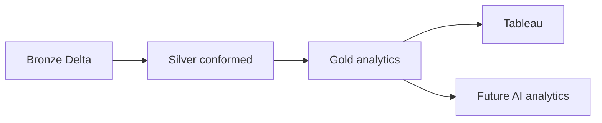

# Silver Conformed Model and Gold Analytics

## Flow and ownership

Bronze owns accepted source-shaped records and ingestion lineage. Silver owns conformance and
valid relationships. Gold owns business aggregation and the canonical metric expressions defined
in `docs/metrics-definition.md` and `config/metrics.yaml`. Tableau reads Gold only.

## Silver tables and rules

The layer contains `silver_dim_date`, `silver_dim_factory`, `silver_dim_line`,
`silver_dim_product`, `silver_dim_component`, `silver_dim_supplier`, `silver_dim_defect`,
`silver_fact_production`, and `silver_fact_quality_event`.

- choose the latest `_ingested_at` record per governed business key;
- trim identifiers/names and standardize codes, enums, and severity casing;
- resolve required dimension and production-lot relationships;
- retain nullable supplier attribution for process-caused failures;
- recheck quantity, date, enumeration, and fact-grain invariants;
- add technical reporting year/week or attribution flags without dashboard aggregation.

Both facts retain their PR #1 grain. Rows failing Silver analytical-quality rules are excluded from
Gold; Bronze/quarantine remain the traceability sources.

## Gold tables

| Table | Consumer question |
|---|---|
| `gold_manufacturing_daily` | How are production, FPY, DPPM, rework, scrap, and WoW FPY trending? |
| `gold_factory_quality` | Which factory is contributing to quality loss? |
| `gold_product_quality` | Did product quality change, or did product mix change? |
| `gold_supplier_quality` | Which attributed supplier/component combinations drive defects? |
| `gold_defect_pareto` | Which defects contribute most, and what is the cumulative share? |

The drill path Factory → Product → Line → Component → Supplier → Defect is supported across the
production and quality-event models. Production KPI tables do not join event rows, preventing
event multiplicity from inflating production denominators.

## Governed metrics

Production Quantity, Pass Quantity, Fail Quantity, FPY, Defect Rate, DPPM, Rework Rate, Scrap
Rate, Yield Loss, WoW FPY Change, Supplier-attributed Defect Rate, and Defect Contribution are
implemented from additive inputs. Rates are divisions of aggregated numerators and denominators;
pre-aggregated percentages are never averaged.

`gold_product_quality.product_mix_share` is intentionally separate from product FPY. For Incident
E, Mexico aggregate FPY can decline as volume moves from X100 to normally lower-yield X200 while
each product's FPY remains approximately stable.

## Execution and idempotency

`databricks/jobs/run_silver_gold.py` executes schema bootstrap, Silver transformations, then Gold
metrics. All models use `CREATE OR REPLACE TABLE ... USING DELTA AS`, so an unchanged Bronze input
produces the same business rows without duplicates. Run `sql/validation/030_silver_gold_validation.sql`
afterward to inspect inventory, duplicate keys, quantity rules, and Incident E evidence.

## Known limitations

- Local tests validate contracts and generated analytical signals; actual workspace counts require
  running the job in Databricks.
- The source has no supplier BOM/allocation fact. Supplier inspected quantity is therefore the
  completed quantity of distinct production lots having an attributed supplier event, and the
  Gold columns retain this caveat through explicit naming.
- Quality events are aggregated synthetic events, not a complete unit inspection ledger. Overall
  FPY and fail quantity therefore come from production facts.
- Full refresh is appropriate for the current six-month synthetic dataset. Incremental MERGE and
  change-data handling are deferred.
- ISO week-year edge handling and fiscal calendars are deferred; the current 2026 horizon does not
  cross a reporting-year boundary.

