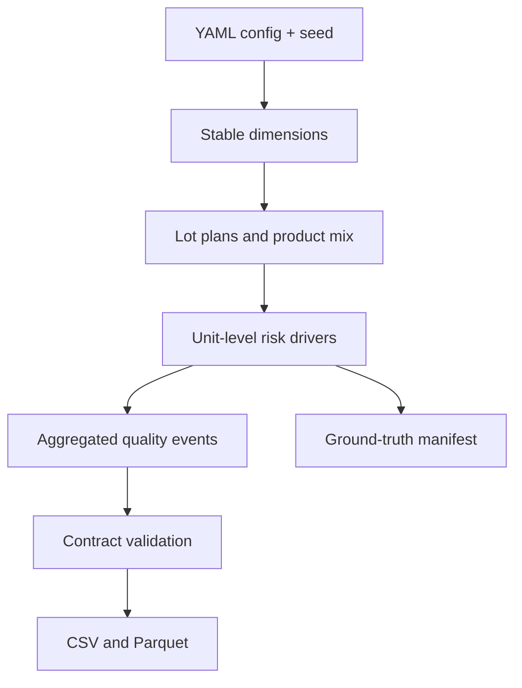

# Synthetic Data Generation

## Purpose and boundary

The generator creates a reproducible, business-realistic AI-server/electronics manufacturing
environment with known hidden causes. It supplies the same source dataset to future Databricks,
SQL, Tableau, RCA, and AI-agent work without embedding answers in analytical tables. All entities
and values are synthetic; no NVIDIA or other proprietary data is used.

## Generation flow



Responsibilities are split across configuration, deterministic RNG, dimensions, production,
quality, incidents, validation, serialization, and orchestration modules. No Spark dependency or
lakehouse behavior is included in PR #2.

## Baseline model

Factory target behavior begins near Taiwan 98%, Mexico 96.5%, and Malaysia 97% FPY. Product
complexity adds stable failure risk; X200 is intentionally the lowest-yield product. Factories use
different base product mixes. Unit outcomes are sampled from these drivers, so realized rates vary
slightly while remaining reproducible and explainable.

`fact_production` retains the PR #1 lot grain. `fact_quality_event` aggregates units that share a
lot and causal classification into `event_quantity`; this keeps output compact without changing
the inspection/defect-event meaning.

## Seed strategy

A single `random.Random` stream is created from the configured integer seed and passed through a
fixed, stable generation order. Therefore identical seed, config, and code version produce the
same ordered records and serialized values. Changing any one of those inputs may change the data.
Tests compare a canonical content hash for equal and unequal seeds.

## Incident injection

Incidents modify underlying drivers only:

- Supplier degradation raises Supplier B Power Module failure probability.
- Calibration drift raises line-local process risk and Voltage Failure probability while clearing
  supplier attribution.
- Ramp-up uses a continuous 120-day learning curve and higher early rework propensity.
- A bad component lot assigns affected units to `CLOT-BAD-001` and raises memory-test risk.
- Product-mix shift changes Mexico product selection weights, not product failure probabilities.

Regression tests verify each expected analytical signal, including the mix-shift trap.

## Configuration and CLI

`config/data_generation.yaml` controls seed, date range, output path, enabled incidents, and named
scales. Explicit CLI flags override seed, output, and scale:

```bash
python scripts/generate_data.py \
  --config config/data_generation.yaml \
  --seed 42 \
  --scale demo \
  --output data/generated \
  --format both
```

`test` supports CI and compact demos; `demo` is the default interactive dataset; `full` increases
lot count and quantity but does not change business rules.

## Ground truth

The JSON manifest records incident ID/type, window, affected entities, expected primary driver,
direction, and description. It is an evaluation oracle only. Future production analytics, Tableau,
and AI tools must infer causes from facts and dimensions independently.

## Validation

Generation fails before writing output when required schemas, PK/natural-key uniqueness, foreign
keys, date ranges, enumerations, or quantity consistency are invalid. Incident regression tests
add signal-level checks on top of structural validation.

## Limitations

- Outcomes are independent unit samples; serial correlation and shift/technician effects are not
  yet modeled.
- Quality events are grouped rather than emitted per physical unit.
- Component sourcing is simplified and does not yet use a product BOM or supplier allocation SCD.
- Calendar, capacity, downtime, incomplete WIP, and multi-stage reinspection are simplified.
- The manifest windows assume the default 2026 horizon; custom horizons may exclude incidents.
- Sample size influences realized rates, so analytical tests use direction and tolerance rather
  than exact KPI values.
